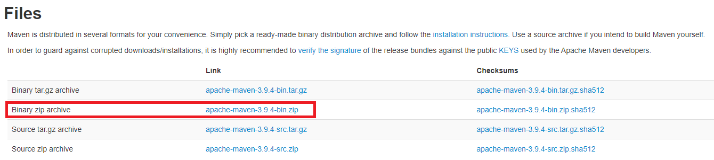
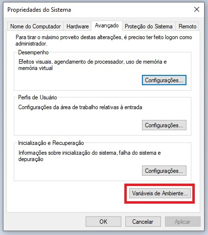
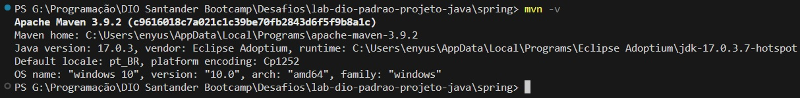
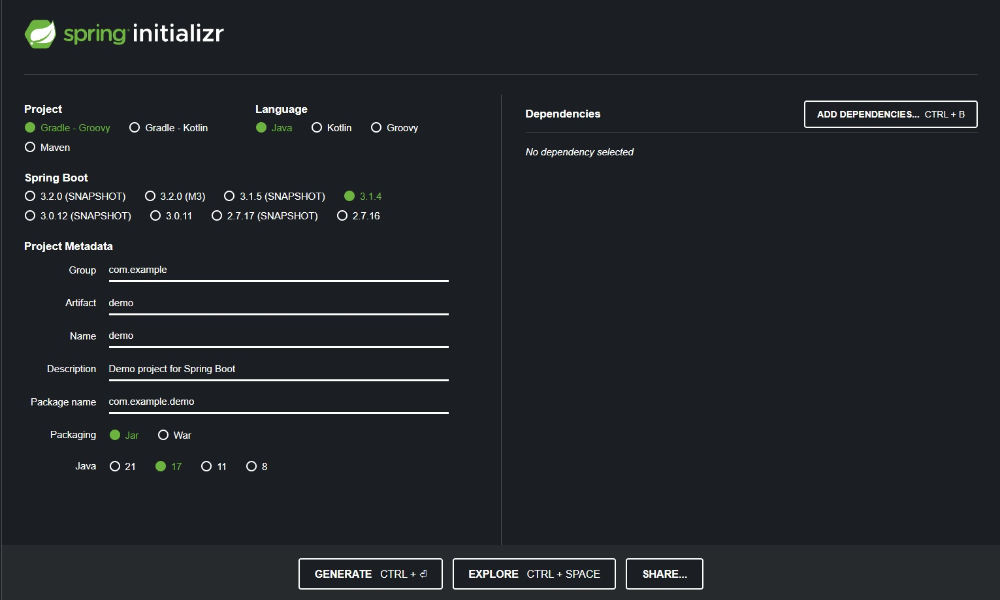
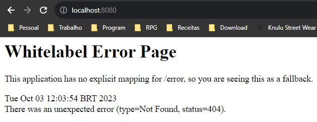
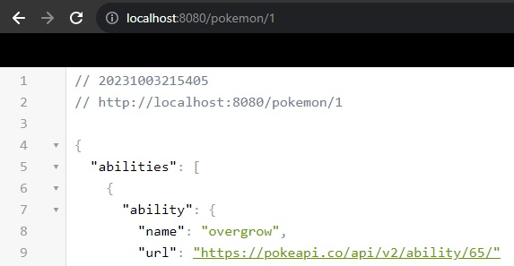
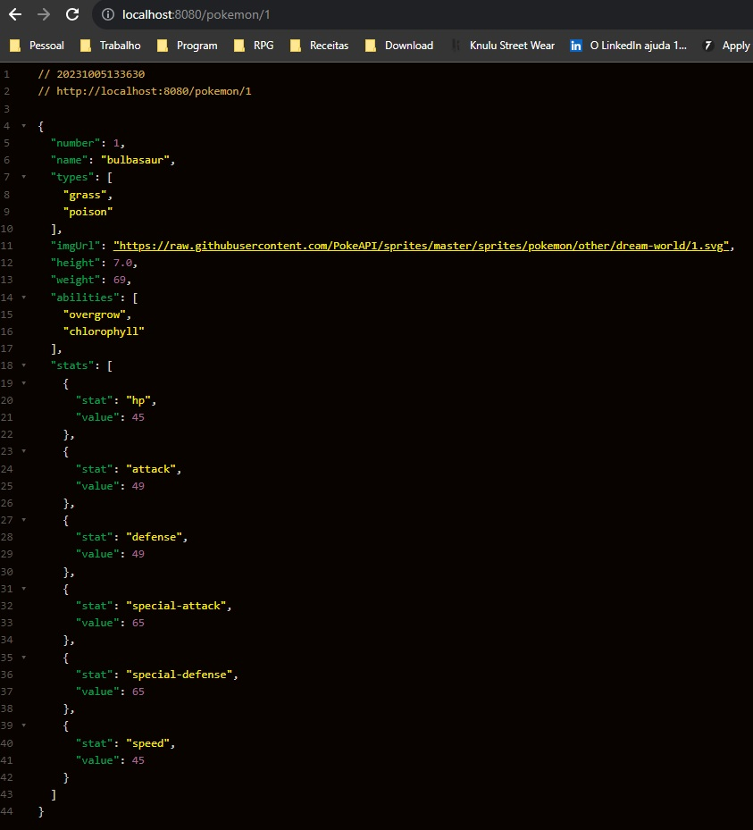
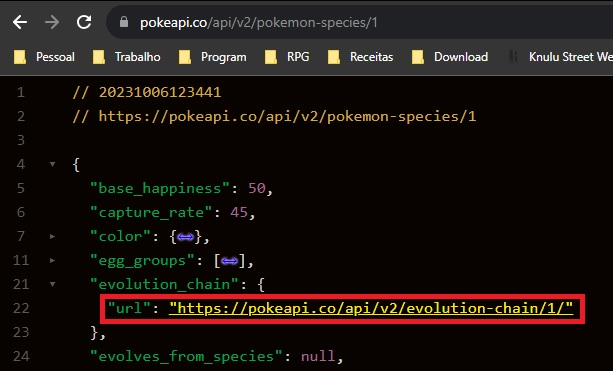

# Lab DIO: Padrões de Projeto com Java
Lab da DIO para o bootcamp Santander Fullstack Java + Angular que explora os padrões de projeto com a linguagem Java.

Como não há um desafio específico bem definido, estou usando este lab mais como uma abordagem teórica sobre o que são os Padrões de Projeto (Design Patterns).

* [Sobre o Desafio](#sobre-o-desafio)
    * [Singleton](#singleton)
    * [Strategy](#strategy)
    * [Facade](#facade)
* [Spring Framework](#spring-framework)
* [Minha versão do desafio](#minha-versão-do-desafio)
    * [Java no VSCode](#java-no-vscode)
    * [Instalando o Maven](#instalando-o-maven)
    * [Iniciando um projeto com o Spring Boot](#iniciando-um-projeto-com-o-springboot)
        * [Problema do Swagger UI](#problema-do-swagger-ui)
    * [Rodando o projeto web](#rodando-o-projeto-web)
    * [Estrutura de Pastas](#estrutura-de-pastas)
        * [Controller](#controller)
        * [Model](#model)
        * [Repository](#repository)
        * [Service](#service)
    * [Passo a passo - WIP](#passo-a-passo)
        * [Feign](#feign)
        * [Model](#model-1)
        * [Evolution Chain](#evolution-chain)


## Sobre o Desafio
Padrões de Projeto são "soluções consolidadas para problemas recorrentes" no desenvolvimento de software. Eles podem ser categorizados em três grupos principais:

* **Padrões Criacionais:** Relacionados a instanciação de um ou múltiplos objetos. Principal objetivo é criar objetos. Um exemplo é o Singleton, que garante que uma classe tenha apenas uma instância.

* **Padrões Comportamentais:** Conseguir definir ou até obrigar determinados comportamentos da estrutura de código; implementar soluções para inferir comportamentos numa determinada estrutura. Ex.: Strategy.
    * *ChatGPT*: Tratam do comportamento das classes e objetos. O Strategy é um exemplo, pois permite definir diferentes algoritmos para resolver o mesmo problema.

* **Padrões Estruturais:** Transformações de informação, orquestrar eventuais integrações com sistemas externos. Ex.: Facade.
    * *ChatGPT*: Lidam com a composição de classes e objetos. O Facade é um exemplo, pois fornece uma interface simplificada para um conjunto de subsistemas.

<p align="right"><a href="#"> 🔝 Voltar ao Topo 🔝 </a></p>

---

### Singleton
Instância única de uma determinada classe.
- Permitir a criação de uma única instância de uma classe e fornecer um modo para recuperá-la.
- Instâncias usam o mesmo endereço de memória.
- Pool de banco de dados.
- Classe da camada de serviços que incorpora as regras de negócio.
- Não alocar novos endereços de memória para alocar múltiplas instâncias de certo objeto.
    - Variação - Preguiçoso (Lazy): Num primeiro momento não disponibiliza a instância para o usuário. Construtor privado. Na chamada da instância, confere se ela já existe ou não.
    - Variação - Apressado (Eager): Atribui a instância quando a variável é definida.
    - Variação - LazyHolder: Uso de memória mais otimizado. Classe estática interna que cria a variável da instância. Thread-safe. [StackOverflow](https://stackoverflow.com/questions/15019306/regarding-static-holder-singleton-pattern).

* *ChatGPT*: O Singleton é um padrão de projeto que garante a existência de apenas uma instância de uma classe e oferece um ponto de acesso global a essa instância. Existem variações de Singleton, como o Lazy Singleton, que cria a instância apenas quando necessário, e o Eager Singleton, que a cria imediatamente. Exemplo de código Java para um Singleton:

```java
public class Singleton {
    private static Singleton instance;

    private Singleton() {}

    public static Singleton getInstance() {
        if (instance == null) {
            instance = new Singleton();
        }
        return instance;
    }
}
```

<p align="right"><a href="#"> 🔝 Voltar ao Topo 🔝 </a></p>

---

### Strategy
Definir um contrato a ser seguido por múltiplas implementações.
- Simplificar a variação de algoritmos para a resolução de um mesmo problema.
- Interface que encapsula ou provê contrato de um determinado algoritmo.
- Uma, ou mais, implementações que disponibilizam variações da estratégia de implementação.
- Ex.: Estratégias de movimentação de um robô.
    - Interface ```Comportamento``` exigindo método de movimentação do robô.
    - Classes de ```ComportamentoNormal```, ```ComportamentoAgressivo``` e ```ComportamentoDefensivo``` que implementam a interface ```Comportamento``` que exige que cada uma delas tenha um método de movimentação definido.
    - Classe ```Robo``` é o contexto, com variável comportamento a ser setado pelas classes ```Comportamento``` (que são as ***estratégias***) que possui também um método ```mover()``` que é delegado à ao ```Comportamento/Estratégia``` atual.

* *ChatGPT*: O Strategy é um padrão que define uma família de algoritmos, encapsula cada um deles e os torna intercambiáveis. Isso permite que o cliente escolha o algoritmo desejado em tempo de execução. Exemplo de código Java para o padrão Strategy:

```java
// Interface que define o contrato para os algoritmos
public interface Comportamento {
    void executar();
}

// Implementações dos algoritmos
public class ComportamentoNormal implements Comportamento {
    public void executar() {
        System.out.println("Comportamento Normal");
    }
}

public class ComportamentoAgressivo implements Comportamento {
    public void executar() {
        System.out.println("Comportamento Agressivo");
    }
}

public class ComportamentoDefensivo implements Comportamento {
    public void executar() {
        System.out.println("Comportamento Defensivo");
    }
}

// Classe que utiliza o Strategy
public class Robo {
    private Comportamento comportamento;

    public Robo(Comportamento comportamento) {
        this.comportamento = comportamento;
    }

    public void setComportamento(Comportamento comportamento) {
        this.comportamento = comportamento;
    }

    public void mover() {
        comportamento.executar();
    }
}
```

<p align="right"><a href="#"> 🔝 Voltar ao Topo 🔝 </a></p>

---

### Facade
Abstrai a complexidade de integrações com múltiplos subsistemas. Interface simplificada e abstraída.
- Prover uma 'interface' que reduza a complexidade nas integrações com subsistemas.
- "Anti-pattern"
- Obtenção de dados de subsistemas.
- Interface que realiza operações ou expor uma interface mais simples.
- Ex: API de consultar CEP.
    - ```migrarCliente``` que tem como parâmetro só nome e CEP.
    - faz ligação com uma ```CrmService``` que para gravar cliente precisa de mais parâmetros.
    - Existe uma classe ```CepApi``` que recupera cidade e estado pelo cep.
    - A intenção é que a classe ```Facade``` com o método ```migrarCliente```, este que consulta os outros subsistemas (```CrmService``` e ```CepAPI```) para realizar a criação da entrada do cliente.

* *ChatGPT*: O Facade é um padrão que fornece uma interface simplificada para um conjunto de subsistemas. Ele oculta a complexidade da interação com esses subsistemas e facilita o uso para o cliente. Exemplo de uso do Facade:

```java
// Classe que representa um subsistema complicado
public class CrmService {
    public void gravarCliente(String nome, String email) {
        // Implementação detalhada para gravar um cliente no CRM
    }
}

// Classe que representa outro subsistema
public class CepApi {
    public String consultarCep(String cep) {
        // Implementação detalhada para consultar um CEP
    }
}

// Facade que simplifica a integração com os subsistemas
public class Facade {
    private CrmService crmService;
    private CepApi cepApi;

    public Facade() {
        this.crmService = new CrmService();
        this.cepApi = new CepApi();
    }

    public void migrarCliente(String nome, String cep) {
        String email = cepApi.consultarCep(cep);
        crmService.gravarCliente(nome, email);
    }
}
```

---

* 👨‍🏫 [Projeto do Professor Java Puro](https://github.com/digitalinnovationone/lab-padroes-projeto-java)


<p align="right"><a href="#"> 🔝 Voltar ao Topo 🔝 </a></p>

## Spring Framework
O Spring já adota alguns dos padrões de projeto acima referidos em seu código, como, por exemplo:
- Singleton: ```@Bean``` e ```@Autowired```;
    - ***(Atenção: Nem todo @Bean é um singleton)***
- Strategy: ```@Service``` e ```@Repository```;
    - CrudRepository
    - ClienteService
    - ***(@Service e @Repository podem ser considerados padrões por si só)***
- Facade: API REST para abstrair a complexidade das integrações: ```Spring Data JPA``` e ```ViaCEP``` (com ```Feign```).
- Módulos do SpringBoot utilizados: Spring Web, Spring Data JPA, H2 Database (banco de dados em memória), Open Feign (Client Rest Declarativo), Swagger (documentação).

* 👨‍🏫 [Projeto do Professor Spring](https://github.com/digitalinnovationone/lab-padroes-projeto-spring).

<p align="right"><a href="#"> 🔝 Voltar ao Topo 🔝 </a></p>

---
---
<br>
<br>

# Minha versão do desafio
Na parte do Java puro eu simplesmente repliquei as orientações do professor simplesmente, mas para usar o Spring framework eu gostaria de fazer algo diferente, especialmente por ser basicamente a primeira vez que eu usava o Spring e o Spring boot do zero. Assim, minha ideia inicial é resolver um problema que tive no lab de [Primeiras Páginas Interativas com Javascript](https://github.com/Enyus/dio-pokedex), no qual a chamada para PokeApi para uma cadeia de evolução de um determinado pokemon não partia de um endpoint único.

Mas vamos por partes. Já que esta foi o meu primeiro contato direto com o Maven, Spring Framework e Spring Boot, quero deixar aqui um passo a passo para caso eu precisar começar novamente do zero as instalações.

<p align="right"><a href="#"> 🔝 Voltar ao Topo 🔝 </a></p>

## Java no VSCode
Eu já tinha instalado o VSCode no meu computador, então o que eu fiz foi simplesmente instalar a extensão ```Extension Pack for Java``` direto no programa. Logo na instalação, foi-me pedido para instalar também a JDK, o que imagino seja necessário para o uso da extensão.

No entanto, conforme dito em aula, é possível baixar o VS Code já com as configurações para o Java [aqui](https://code.visualstudio.com/docs/languages/java).

Ao rodar o comando ```java -version``` num prompt de comandos, será apresentada sua versão instalada do java.

<p align="right"><a href="#"> 🔝 Voltar ao Topo 🔝 </a></p>

## Instalando o Maven
O Maven é um gerenciador de pacotes e empacotamento que "está para o Java como o npm está para o Node/Javascript". Sua instalação, porém, não é tão simples quanto à do Node, devendo ser seguidos os seguintes passos:

(Uso o sistema operacional Windows 10)

1. Baixar o Maven [neste site](https://maven.apache.org/download.cgi) escolhendo a opção "Binary zip archive"

[Aqui tem um guia rápido, em inglês, do que fazer em seguida](https://maven.apache.org/install.html).
2. Descompactar o arquivo baixado em algum diretório do computador. Colocar a pasta resultante em algum diretório que lhe convenha, de preferência junto com seus demais arquivos do Java.
3. Dentro da pasta descompactada (que provavelmente se chamará apache-maven-{versão}), haverá uma pasta chamada ```bin```. Será necessário adicionar o endereço desta pasta à variável de ambiente ```PATH```.
4. Entre na pasta ```bin``` e copie seu endereço:
5. No campo de pesquisa da barra de tarefas, digite ```Editar as variáveis de ambiente do sistema```:

6. Na janela que aparecerá (Propriedades do Sistema), clique no botão ```Variáveis de ambiente...```

7. Na tela seguinte, no campo "Variáveis do sistema", selecione o item ```Path``` e clique em ```Editar...```, clique em ```Novo``` e cole o caminho da pasta bin do arquivo baixado anteriormente e clique em ```OK```;
8. Caso a instalação tenha sido feita corretamente, num prompt de comando, o comando ```mvn -v``` mostrará no console a versão do maven que foi instalada.


<p align="right"><a href="#"> 🔝 Voltar ao Topo 🔝 </a></p>

## Iniciando um projeto com o SpringBoot
A criação de um projeto com o SpringBoot é razoavelmente simples, especialmente se usarmos o [Spring Initializr](https://start.spring.io/):

1. No lado esquerdo, deve-se selecionar o gerenciador de projetos (Maven, no caso), a linguagem de programação (Java, no caso), qual a versão do Spring Boot (usei 3.1.4) e alguns outros dados do projeto e a versão do Java desejada (usei 17).
2. No lado direito, devem ser escolhidas quais as dependências que deverão ser adicionadas ao projeto. Usei basicamente as mesmas que o professor: Spring Web, Spring Data JPA, H2 Database (apesar que, provavelmente, para o meu intuito não seria necessário um banco de dados), Open Feign e Swagger (veja minha dificuldade com o Swagger abaixo).
3. Ao clicar em "Generate", um arquivo zip será criado e poderá ser baixado do site.
4. Ao descompactar o arquivo baixado, um projeto já estará pré-criado dentro da pasta gerada, que poderá ser aberta em uma IDE.
5. Com um prompt de comando dentro da pasta do projeto, as dependências poderão ser instaladas com o comando ```mvn install```.

<p align="right"><a href="#"> 🔝 Voltar ao Topo 🔝 </a></p>

## Problema do Swagger UI
Talvez por algum problema com versões, ou por outra coisa que não consegui deduzir, o Swagger não apareceu nas dependências disponíveis no Spring Initializr. Assim, adicionei tal dependência manualmente, cujo passo a passo vai a seguir:

1. No site [Maven Repository](https://mvnrepository.com/artifact/io.springfox/springfox-swagger-ui/3.0.0) é apresentada a estrutura a ser incluída no arquivo pom.xml:
```xml
    <!-- https://mvnrepository.com/artifact/io.springfox/springfox-swagger-ui -->
    <dependency>
        <groupId>io.springfox</groupId>
        <artifactId>springfox-swagger-ui</artifactId>
        <version>3.0.0</version>
    </dependency>
```
2. Adicionando o código acima no arquivo ```pom.xml```, basta entrar na pasta do projeto maven e rodar o código ```mvn install``` para que todas as dependências sejam baixadas para o repositório local.
3. Ainda assim, o endpoint ```http://localhost:8080/swagger-ui.html``` não estava funcionando. Então fiz uma consulta do erro que o mvn apresentava e encontrei [este artigo do Stack Overflow](https://stackoverflow.com/questions/74701738/spring-boot-3-springdoc-openapi-ui-doesnt-work) que mencionava a incompatibilidade do swagger com o Spring Boot v3, e indicava que o correto seria usar a dependência ```springdoc-openapi v2```:
```xml
<dependency>
    <groupId>org.springdoc</groupId>
    <artifactId>springdoc-openapi-starter-webmvc-ui</artifactId>
    <version>2.0.0</version>
</dependency>
```
E funcionou.

<p align="right"><a href="#"> 🔝 Voltar ao Topo 🔝 </a></p>

## Rodando o projeto web
Uma vez que as dependências forem corretamente instaladas, é possível executar a aplicação com o comando ```mvn spring-boot:run``` no prompt, e a aplicação será carregada na porta ```http://localhost:8080/```. Caso não haja nenhuma rota mapeada, a seguinte mensagem confirmará que a aplicação está rodando:



Para para a aplicação, basta usar ```ctrl + c``` no prompt de comando e escolher Sim (S) quando for questionado se "Deseja finalizar o arquivo em lotes".

<p align="right"><a href="#"> 🔝 Voltar ao Topo 🔝 </a></p>

## Estrutura de Pastas
Faz parte das boas práticas usar uma estrutura padrão para os Pacotes/Pastas do projeto. Como se trata de um projeto Web para uma API, é seguido um padrão semelhante ao modelo MVC. No caso em específico, usarei as três principais camadas: Controller, Model e Service.

```
    +- \src\main\java\spring\designpatterns
       +- Application.java
       |
       +- controller
       |
       +- model
       |
       +- service
       |
```

### Controller
Esta camada servirá principalmente para determinar os endpoints da API, tratando os ```requests``` e ```responses``` HTML.

| *ChatGPT:* | *Os controladores lidam com as solicitações HTTP, mapeando-as para métodos e retornando respostas apropriadas. Eles são responsáveis pela interação com o cliente.* |
| ---- | ---- |

### Model
Esta camada determinará como são formados os objetos de dados da aplicação, geralmente usada para a determinação de como o banco de dados é estruturado (nome da tabela, nome das colunas, restrições dos dados, etc.)

| *ChatGPT:* | *Nesta pasta, você coloca as classes que representam os modelos de dados da sua aplicação. Isso inclui entidades, DTOs (Data Transfer Objects) e outras classes relacionadas à lógica de negócios da aplicação.* |
| ---- | ---- |

### Repository
Pelo que vi, as classes guardadas na camada Repository (que geralmente guarda classes denominadas ```DadoRespository.java```) descrevem especificamente as buscas (queries) que estarão disponíveis ao projeto.

| *ChatGPT:* | *Esta pasta contém classes que encapsulam o acesso ao banco de dados, geralmente usando o Spring Data JPA ou outro mecanismo de persistência.* |
| ---- | ---- |

### Service
Nesta camada, pelo que entendi, estão as classes que realmente vão fazer o "trabalho" na API, usando os modelos e respositories para implementar as regras de negócio e devolver uma resposta ao controller.

| *ChatGPT:* | *Aqui, você coloca classes que contêm a lógica de negócios da sua aplicação. Os serviços podem fazer uso dos repositórios para buscar ou salvar dados.* |
| ---- | ---- |

<p align="right"><a href="#"> 🔝 Voltar ao Topo 🔝 </a></p>

## Passo a passo
[WIP]
Abaixo vou descrever algumas informações que podem ser úteis para a utilização de cada módulo do projeto.

### Feign
O Feign é um módulo que permite fazer, de maneira declarativa, chamadas a APIs externas. Para que ele funcione da maneira correta, a primeira coisa a ser feita é adicionar a anotação ```@EnableFeignClients``` no arquivo principal do projeto (```Application.java```):

```java
    // Outras importações
    import org.springframework.cloud.openfeign.EnableFeignClients; //Importação da anotação @EnableFeignClients

    @EnableFeignClients // Permite o uso do Feign no projeto
    @SpringBootApplication
    public class Application {

        public static void main(String[] args) {
            SpringApplication.run(Application.class, args);
        }

    }
```

O Feign me permitirá acessar a [PokeAPI](https://pokeapi.co/). A Intenção é tratar os dados para que a API retorne um JSON formatado apenas com as informações que serão relevantes para o Front.

Inclui na pasta ```service``` a ***interface*** (é importante lembrar que a declaração do Feign é através de um interface, não de uma classe) de utilização do Feign, que chamei de ```PokeApiService.java```, ela ficou mais ou menos assim:

```java
// Informações sobre o pacote e importações

@FeignClient(name = "pokeapi", url = "https://pokeapi.co/api/v2/pokemon") // Anotação que declara o uso do Feign e a endpoint básica, que será ampliada com o {id} do pokemon abaixo
public interface PokeApiService {
    @GetMapping("/{id}") // Esta anotação demonstra que é uma chamada GET com uma parâmetro {id}, este que é adicionado à endpoint básica para completar a URL completa da chamada
    Object getPokemonBase(@PathVariable("id") int pokemonNumber);
}
```

Até o momento, como é possível ver no código, não criei um model para os dados recebidos e preciso pesquisar um modo de fazê-lo apenas com as informações úteis.

Criei, também na pasta ```service```, a classe ```PokemonService.java``` que será responsável por invocar o Feign e tratar os dados, que ficou mais ou menos assim:

```java
// Informações sobre o pacote e importações

@Service // Anotação do Spring que marca a classe como um Serviço
public class PokemonService {
    
    @Autowired // Anotação para instanciar automaticamente a interface do Feign
    private PokeApiService pokeApiService;

    // Novamente retornando um Object porque ainda não fiz o modelo de dados
    public Object getPokemonByNumber(int number){
        return pokeApiService.getPokemonBase(number);
    }
}
```

Por sua vez, esta classe de serviço será invocada no ```controller```, então criei sua pasta e uma classe dentro dela com o nome ```PokemonController.java``` que ficou assim:

```java
// Informações sobre o pacote e importações

@RestController // Anotação do Spring que declara a classe como um controller
@RequestMapping("pokemon") // Anotação para indicar que a classe vai envolver a url com caminho localhost:8080/pokemon
public class PokemonController {

    @Autowired // Anotação para instanciar automaticamente o PokemonService
    private PokemonService pokemonService;

    @GetMapping("/{number}") // Indica que o métodos abaixo será acionado no endpoint localhost:8080/pokemon/{número do pokemon}
    public ResponseEntity<Object> getPokemonByNumber(@PathVariable int number){
        return ResponseEntity.ok(pokemonService.getPokemonByNumber(number));
    }
    // A Anotação @PathVariable "traduz" a informação que será pega da rota (em @GetMapping)
    // o método "ok" informa que a resposta mostrará um status 200 
```

Por enquanto, a chamada ```localhost:8080/pokemon/1``` retorna o mesmo JSON que a PokeAPI:




<p align="right"><a href="#"> 🔝 Voltar ao Topo 🔝 </a></p>

### Model
Vou tentar usar a pasta Model para criar um modelo de estrutura de dados para o JSON retornado, apenas com as informações que serão utilizadas no Front, que no momento acho ser algo assim:

```JSON
{
    "number": 1,
    "name":"bulbasaur",
    "types": ["grass", "poison"],
    "imgUrl": "",
    "species": "bulbasaur",
    "height": 0.7,
    "weight": 69,
    "abilities": ["overgrow", "chlorophyll"],
    "stats": [
        {
            "stat": "HP",
            "value": 45
        },
        {
            "stat": "Attack",
            "value": 49
        },
        {
            "stat": "Defense",
            "value": 49
        },
        {
            "stat": "Sp. Attack",
            "value": 65
        },
        {
            "stat": "Sp. Defense",
            "value": 65
        },
        {
            "stat": "Speed",
            "value": 45
        }
    ],
    "evolutionChain":[
        {
            "name": "bulbasaur",
            "evolvesTo": "ivysaur"
        },
        {
            "name": "ivysaur",
            "evolvesTo": "venusaur"
        }
    ]

}
```
Mas ainda preciso descobrir como manipuar a resposta da PokeAPI com Java. A criação de um modelo específico para esta resposta é inviável, já que ela tem muitos caracteres.

Após uma rápida busca pela internet, encontrei [este artigo do DevMedia](https://www.devmedia.com.br/json-manipulacao-de-estruturas-complexas-na-linguagem-java/25505) que tratava da manipulação de arquivos JSON com java com a dependência ```org.json``` ([Veja no MavenRepository](https://mvnrepository.com/artifact/org.json/json/20230618)) que poderia resolver meu problema, então tentei adicionar a nova dependência ao projeto:

```xml
<!-- Arquivo pom.xml -->
<!-- https://mvnrepository.com/artifact/org.json/json -->
<dependency>
    <groupId>org.json</groupId>
    <artifactId>json</artifactId>
    <version>20230618</version>
</dependency>
```

A dependência foi adicionado com o comando ```mvn clean install``` na pasta do projeto spring.

Para meu infortúnio, porém, um Object que é o resultado da API transformam o ":" dos pares de chave e valor do JSON vindo da pokeAPI para "=", então tentei usar a dependência ```gson``` ([Veja no MavenRepository](https://mvnrepository.com/artifact/com.google.code.gson/gson/2.10.1))

```xml
<!-- Arquivo pom.xml -->
<!-- https://mvnrepository.com/artifact/com.google.code.gson/gson -->
<dependency>
    <groupId>com.google.code.gson</groupId>
    <artifactId>gson</artifactId>
    <version>2.10.1</version>
</dependency>
```

Finalmente, certamente não com a melhor otimização do mundo, o endpoint ```localhost:8080/pokemon/1``` retornou o desejado:




<p align="right"><a href="#"> 🔝 Voltar ao Topo 🔝 </a></p>


### Evolution Chain
Agora o desafio é fazer uma segunda consulta à API para conseguir as evoluções do pokemon.

Como pode ser observado [no README do front](https://github.com/Enyus/dio-pokedex), para conseguir a cadeia de evoluções do pokemon, é necessário acessar não apenas um, mas três endpoints da pokeAPI:

* ```https://pokeapi.co/api/v2/pokemon-species/<numero do pokemon>``` - este endpoint permite consultar a "Evolution Chain" de um determinado pokemon, na verdade, apenas dá a URL de outro endpoint que, este sim, dá as informações das evoluções do pokemon.

    * Veja que isso retorna uma URL e não a ```id``` da evolution chain, então também precisará de uma manipulação desta string, pelo menos até o ponto que conheço do Feign.

* ```https://pokeapi.co/api/v2/evolution-chain/<id da evolution chain>``` - este endpoint, veja que ele não depende do id/numero/nome do pokemon, apresenta os nomes das evoluções do pokemon, se existentes. Com estes, tive que fazer novas chamadas no primeiro endpoint para conseguir a imagem das evoluções.
    * A resposta desta requisição envolve uma outra complexa estrutura JSON, mas pelo menos mostra todas as evoluções do pokemon, mas por nome (String) e não por um id (int).
    * Assim, para facilitar o próximo passo, transformei o parâmetro da chamada básica do Feign (```getPokemonBase```) para aceitar uma String ao invés de um int como havia feito anteriormente.

* ```https://pokeapi.co/api/v2/pokemon/<id ou nome do pokemon>/``` - este é o endpoint padrão, mas precisarei recorrer a ele para conseguir as imagens das evoluções.

Adicionando esses endpoints ao Feign, o arquivo ```pokeApiService.java``` ficou assim:
```java
// Importações

@FeignClient(name = "pokeapi", url = "https://pokeapi.co/api/v2")
public interface PokeApiService {
    
    @GetMapping("/pokemon/{id}")
    Object getPokemonBase(@PathVariable("id") String pokemonIdentifier);

    @GetMapping("pokemon-species/{species}")
    Object getPokemonSpecies(@PathVariable("species") String pokemonSpecies);

    @GetMapping("evolution-chain/{id}")
    Object getEvolutionChain(@PathVariable("id") String evolutionChainIdentifier);
}
```


<p align="right"><a href="#"> 🔝 Voltar ao Topo 🔝 </a></p>

---
---